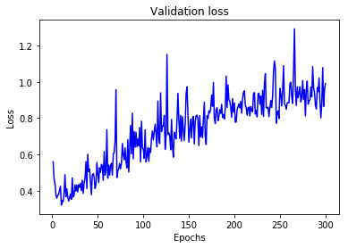

```python
import random
import matplotlib.pyplot as plt

from keras import models
from keras import layers
from keras import optimizers
from keras import regularizers
from keras.datasets import fashion_mnist
from keras.utils import to_categorical
from sklearn.model_selection import train_test_split
```

    Using TensorFlow backend.
    


```python
random.seed(1234)
#load data
(x_train, y_train), (x_test, y_test) = fashion_mnist.load_data()

#transform image data into 2d-tensor
x_train = x_train.reshape((60000, 28*28))
x_train = x_train.astype('float32') / 255

x_test = x_test.reshape((10000, 28*28))
x_test = x_test.astype('float32')/ 255

#make y categorical type
y_train = to_categorical(y_train)
y_test = to_categorical(y_test)

#split train set into train sand validation
x_train_50000, x_val, y_train_50000, y_val = train_test_split(x_train, y_train, test_size = 1/6, random_state = 1)

#check shapes
print(x_train.shape, y_train.shape, 
      x_train_50000.shape, y_train_50000.shape,
      x_val.shape, y_val.shape, x_test.shape, y_test.shape)
```

    (60000, 784) (60000, 10) (50000, 784) (50000, 10) (10000, 784) (10000, 10) (10000, 784) (10000, 10)
    


```python
#initialize sequential models with 5 layers + 512 hidden units for each layer
model = models.Sequential()
model.add(layers.Dense(512, activation = 'relu', input_shape=(784,)))
model.add(layers.Dense(512, activation = 'relu'))
model.add(layers.Dense(512, activation = 'relu'))
model.add(layers.Dense(512, activation = 'relu'))
model.add(layers.Dense(512, activation = 'relu'))
model.add(layers.Dense(10, activation = 'softmax'))

model.compile(optimizer = 'rmsprop',
              loss = 'categorical_crossentropy',
              metrics = ['accuracy'])

#epoch should be 200
history = model.fit(x_train_50000, y_train_50000, 
                    batch_size = 512, epochs = 300,
                    validation_data = (x_val, y_val),verbose = 0)
```

    WARNING:tensorflow:From /home/ubuntu/anaconda3/envs/tensorflow_p36/lib/python3.6/site-packages/tensorflow/python/framework/op_def_library.py:263: colocate_with (from tensorflow.python.framework.ops) is deprecated and will be removed in a future version.
    Instructions for updating:
    Colocations handled automatically by placer.
    WARNING:tensorflow:From /home/ubuntu/anaconda3/envs/tensorflow_p36/lib/python3.6/site-packages/tensorflow/python/ops/math_ops.py:3066: to_int32 (from tensorflow.python.ops.math_ops) is deprecated and will be removed in a future version.
    Instructions for updating:
    Use tf.cast instead.
    


```python
#Plotting the validation set loss over the epochs
history_dict = history.history
val_loss_values = history_dict['val_loss']
val_acc_values = history_dict['val_acc']
epochs = range(1, len(val_loss_values) + 1)

plt.plot(epochs, val_loss_values, 'b', label = "Validation loss")
plt.title("Validation loss")
plt.xlabel('Epochs')
plt.ylabel('Loss')
plt.show()
```





```python
plt.clf()
#Plotting the validation set accuracy over the epochs
plt.plot(epochs, val_acc_values, 'b', label = "Validation acc")
plt.title("Validation Accuracy")
plt.xlabel('Epochs')
plt.ylabel("Accuracy")
plt.show()
```


 * It seems that the model degrades after 50 epoches for the initial model.

2. Implement dropout


```python
model_dropout = models.Sequential()
model_dropout.add(layers.Dense(512, activation = 'relu', input_shape=(784,)))
model_dropout.add(layers.Dropout(0.5))
model_dropout.add(layers.Dense(512, activation = 'relu'))
model_dropout.add(layers.Dropout(0.5))
model_dropout.add(layers.Dense(512, activation = 'relu'))
model_dropout.add(layers.Dropout(0.5))
model_dropout.add(layers.Dense(512, activation = 'relu'))
model_dropout.add(layers.Dropout(0.5))
model_dropout.add(layers.Dense(512, activation = 'relu'))
model_dropout.add(layers.Dropout(0.5))
model_dropout.add(layers.Dense(10, activation = 'softmax'))

model_dropout.compile(optimizer = 'rmsprop',
              loss = 'categorical_crossentropy',
              metrics = ['accuracy'])

#x_train_partial --> x_train, y_train_partial --> y_train (the same for validation data later)
#epoch should be 200
dropout_history = model_dropout.fit(x_train_50000, y_train_50000, 
                    batch_size = 512, epochs = 300,
                    validation_data = (x_val, y_val), verbose = 0)
```

    WARNING:tensorflow:From /home/ubuntu/anaconda3/envs/tensorflow_p36/lib/python3.6/site-packages/keras/backend/tensorflow_backend.py:3445: calling dropout (from tensorflow.python.ops.nn_ops) with keep_prob is deprecated and will be removed in a future version.
    Instructions for updating:
    Please use `rate` instead of `keep_prob`. Rate should be set to `rate = 1 - keep_prob`.
    


```python
#Plotting the validation set loss over the epochs
dropout_history_dict = dropout_history.history
dropout_val_loss_values = dropout_history_dict['val_loss']
dropout_val_acc_values = dropout_history_dict['val_acc']
epochs = range(1, len(dropout_val_loss_values) + 1)

plt.plot(epochs, dropout_val_loss_values, 'b', label = "Dropout Validation loss")
plt.plot(epochs, val_loss_values, 'r', label = "Initial Validation Loss")
plt.title("Validation loss")
plt.xlabel('Epochs')
plt.ylabel('Loss')
plt.legend()
plt.show()
```


```python
plt.clf()
#Plotting the validation set accuracy over the epochs
plt.plot(epochs, dropout_val_acc_values, 'b', label = "Dropout Validation acc")
plt.plot(epochs, val_acc_values, 'r', label = "Initial Validation acc")
plt.title("Validation Accuracy")
plt.xlabel('Epochs')
plt.ylabel("Accuracy")
plt.legend()
plt.show()
```


 * I think the dropout model is better than the initial model in terms of minimizing the validation loss. But after 250 epoches, the dropout model performs worse than the initial model in terms of the validation accuracy.

3. Weight regularization


```python
#L1 reg model
model_reg1 = models.Sequential()
model_reg1.add(layers.Dense(512, activation = 'relu', 
                            input_shape=(784,),
                            kernel_regularizer = regularizers.l1(0.001)))
model_reg1.add(layers.Dense(512, activation = 'relu', 
                            kernel_regularizer = regularizers.l1(0.001)))
model_reg1.add(layers.Dense(512, activation = 'relu', 
                            kernel_regularizer = regularizers.l1(0.001)))
model_reg1.add(layers.Dense(512, activation = 'relu', 
                            kernel_regularizer = regularizers.l1(0.001)))
model_reg1.add(layers.Dense(512, activation = 'relu', 
                            kernel_regularizer = regularizers.l1(0.001)))
model_reg1.add(layers.Dense(10, activation = 'softmax'))

model_reg1.compile(optimizer = 'rmsprop',
              loss = 'categorical_crossentropy',
              metrics = ['accuracy'])

#x_train_partial --> x_train, y_train_partial --> y_train (the same for validation data later)
#epoch should be 200

#L2 reg model
model_reg2 = models.Sequential()
model_reg2.add(layers.Dense(512, activation = 'relu', 
                            input_shape=(784,),
                            kernel_regularizer = regularizers.l2(0.001)))
model_reg2.add(layers.Dense(512, activation = 'relu', 
                            kernel_regularizer = regularizers.l2(0.001)))
model_reg2.add(layers.Dense(512, activation = 'relu', 
                            kernel_regularizer = regularizers.l2(0.001)))
model_reg2.add(layers.Dense(512, activation = 'relu', 
                            kernel_regularizer = regularizers.l2(0.001)))
model_reg2.add(layers.Dense(512, activation = 'relu', 
                            kernel_regularizer = regularizers.l2(0.001)))
model_reg2.add(layers.Dense(10, activation = 'softmax'))

model_reg2.compile(optimizer = 'rmsprop',
              loss = 'categorical_crossentropy',
              metrics = ['accuracy'])


history_reg1 = model_reg1.fit(x_train_50000, y_train_50000, 
                    batch_size = 512, epochs = 300,
                    validation_data = (x_val, y_val), verbose = 0)

history_reg2 = model_reg2.fit(x_train_50000, y_train_50000, 
                    batch_size = 512, epochs = 300,
                    validation_data = (x_val, y_val), verbose = 0)

reg1_history_dict = history_reg1.history
reg1_val_loss_values = reg1_history_dict['val_loss']
reg1_val_acc_values = reg1_history_dict['val_acc']

reg2_history_dict = history_reg2.history
reg2_val_loss_values = reg2_history_dict['val_loss']
reg2_val_acc_values = reg2_history_dict['val_acc']
```


```python
#Plotting the validation set loss over the epochs
plt.clf()
plt.plot(epochs, val_loss_values, 'r', label = "Initial_Validation Loss")
plt.plot(epochs, dropout_val_loss_values, 'b', label = "Dropout Validation loss")
plt.plot(epochs, reg1_val_loss_values, 'g', label = "L1 Validation loss")
plt.plot(epochs, reg2_val_loss_values, 'k', label = "L2 Validation loss")

plt.title("Validation loss")
plt.xlabel('Epochs')
plt.ylabel('Loss')
plt.legend()
plt.show()
```


```python
plt.clf()
plt.plot(epochs, val_loss_values, 'r', label = "Initial_Validation Loss")
plt.plot(epochs, dropout_val_loss_values, 'b', label = "Dropout Validation loss")
plt.plot(epochs, reg2_val_loss_values, 'k', label = "L2 Validation loss")

plt.title("Validation loss")
plt.xlabel('Epochs')
plt.ylabel('Loss')
plt.legend()
plt.show()
```


 * Here we can see that the L2 model performs better than L1 model. 
