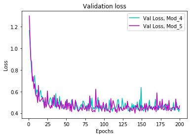

```python
import random
import matplotlib.pyplot as plt

from keras import models
from keras import layers
from keras import optimizers
from keras import regularizers
from keras.datasets import fashion_mnist
from keras.utils import to_categorical
from sklearn.model_selection import train_test_split
```

    Using TensorFlow backend.
    


```python
random.seed(1234)
#load data
(x_train, y_train), (x_test, y_test) = fashion_mnist.load_data()

#transform image data into 2d-tensor
x_train = x_train.reshape((60000, 28*28))
x_train = x_train.astype('float32') / 255

x_test = x_test.reshape((10000, 28*28))
x_test = x_test.astype('float32')/ 255

#make y categorical type
y_train = to_categorical(y_train)
y_test = to_categorical(y_test)

#split train set into train sand validation
x_train_50000, x_val, y_train_50000, y_val = train_test_split(x_train, y_train, test_size = 1/6, random_state = 1)

#check shapes
print(x_train.shape, y_train.shape, 
      x_train_50000.shape, y_train_50000.shape,
      x_val.shape, y_val.shape, x_test.shape, y_test.shape)
```

    (60000, 784) (60000, 10) (50000, 784) (50000, 10) (10000, 784) (10000, 10) (10000, 784) (10000, 10)
    

three settings 

layers: 5, 10
units: 256, 512, 1024
L2 = 0.001

in total 12 settings


```python
# Model 1 --> layer 5, units 128, no l2 reg, 200 epchs

model_1 = models.Sequential()
model_1.add(layers.Dense(128, activation = 'relu', input_shape=(784,)))
model_1.add(layers.Dense(128, activation = 'relu'))
model_1.add(layers.Dense(128, activation = 'relu'))
model_1.add(layers.Dense(128, activation = 'relu'))
model_1.add(layers.Dense(128, activation = 'relu'))
model_1.add(layers.Dense(10, activation = 'softmax'))

model_1.compile(optimizer = 'rmsprop',
              loss = 'categorical_crossentropy',
              metrics = ['accuracy'])

history_1 = model_1.fit(x_train_50000, y_train_50000, 
                    batch_size = 512, epochs = 200,
                    validation_data = (x_val, y_val), verbose = 0)

history_dict_1 = history_1.history
loss_1 = history_dict_1['val_loss']
acc_1 = history_dict_1['val_acc']
```

    WARNING:tensorflow:From /home/ubuntu/anaconda3/envs/tensorflow_p36/lib/python3.6/site-packages/tensorflow/python/framework/op_def_library.py:263: colocate_with (from tensorflow.python.framework.ops) is deprecated and will be removed in a future version.
    Instructions for updating:
    Colocations handled automatically by placer.
    WARNING:tensorflow:From /home/ubuntu/anaconda3/envs/tensorflow_p36/lib/python3.6/site-packages/tensorflow/python/ops/math_ops.py:3066: to_int32 (from tensorflow.python.ops.math_ops) is deprecated and will be removed in a future version.
    Instructions for updating:
    Use tf.cast instead.
    


```python
#Model 2 layer 5, units 256, no l2

model_2 = models.Sequential()
model_2.add(layers.Dense(256, activation = 'relu', input_shape=(784,)))
model_2.add(layers.Dense(256, activation = 'relu'))
model_2.add(layers.Dense(256, activation = 'relu'))
model_2.add(layers.Dense(256, activation = 'relu'))
model_2.add(layers.Dense(256, activation = 'relu'))
model_2.add(layers.Dense(10, activation = 'softmax'))

model_2.compile(optimizer = 'rmsprop',
              loss = 'categorical_crossentropy',
              metrics = ['accuracy'])

history_2 = model_2.fit(x_train_50000, y_train_50000, 
                    batch_size = 512, epochs = 200,
                    validation_data = (x_val, y_val), verbose = 0)

history_dict_2 = history_2.history
loss_2 = history_dict_2['val_loss']
acc_2 = history_dict_2['val_acc']
```


```python
# Model 3 layer 5, units 512, no l2 
model_3 = models.Sequential()
model_3.add(layers.Dense(512, activation = 'relu', input_shape=(784,)))
model_3.add(layers.Dense(512, activation = 'relu'))
model_3.add(layers.Dense(512, activation = 'relu'))
model_3.add(layers.Dense(512, activation = 'relu'))
model_3.add(layers.Dense(512, activation = 'relu'))
model_3.add(layers.Dense(10, activation = 'softmax'))

model_3.compile(optimizer = 'rmsprop',
              loss = 'categorical_crossentropy',
              metrics = ['accuracy'])

history_3 = model_3.fit(x_train_50000, y_train_50000, 
                    batch_size = 512, epochs = 200,
                    validation_data = (x_val, y_val), verbose = 0)

history_dict_3 = history_3.history
loss_3 = history_dict_3['val_loss']
acc_3 = history_dict_3['val_acc']
```


```python
# Model 4 layer 5, units 128, l2 reg 0.001
model_4 = models.Sequential()
model_4.add(layers.Dense(128, activation = 'relu', 
                         input_shape=(784,),
                         kernel_regularizer = regularizers.l2(0.001)))

model_4.add(layers.Dense(128, activation = 'relu', 
                         kernel_regularizer = regularizers.l2(0.001)))

model_4.add(layers.Dense(128, activation = 'relu', 
                         kernel_regularizer = regularizers.l2(0.001)))

model_4.add(layers.Dense(128, activation = 'relu', 
                         kernel_regularizer = regularizers.l2(0.001)))

model_4.add(layers.Dense(128, activation = 'relu', 
                         kernel_regularizer = regularizers.l2(0.001)))

model_4.add(layers.Dense(10, activation = 'softmax'))

model_4.compile(optimizer = 'rmsprop',
              loss = 'categorical_crossentropy',
              metrics = ['accuracy'])

history_4 = model_4.fit(x_train_50000, y_train_50000, 
                    batch_size = 512, epochs = 200,
                    validation_data = (x_val, y_val), verbose = 0)

history_dict_4 = history_4.history
loss_4 = history_dict_4['val_loss']
acc_4 = history_dict_4['val_acc']
```


```python
# Model 5 layer 5 units 256 l2 reg 0.001
model_5 = models.Sequential()
model_5.add(layers.Dense(256, activation = 'relu', 
                         input_shape=(784,),
                         kernel_regularizer = regularizers.l2(0.001)))

model_5.add(layers.Dense(256, activation = 'relu', 
                         kernel_regularizer = regularizers.l2(0.001)))

model_5.add(layers.Dense(256, activation = 'relu', 
                         kernel_regularizer = regularizers.l2(0.001)))

model_5.add(layers.Dense(256, activation = 'relu', 
                         kernel_regularizer = regularizers.l2(0.001)))

model_5.add(layers.Dense(256, activation = 'relu', 
                         kernel_regularizer = regularizers.l2(0.001)))

model_5.add(layers.Dense(10, activation = 'softmax'))

model_5.compile(optimizer = 'rmsprop',
              loss = 'categorical_crossentropy',
              metrics = ['accuracy'])

history_5 = model_5.fit(x_train_50000, y_train_50000, 
                    batch_size = 512, epochs = 200,
                    validation_data = (x_val, y_val), verbose = 0)

history_dict_5 = history_5.history
loss_5 = history_dict_5['val_loss']
acc_5 = history_dict_5['val_acc']
```


```python
# Model 6 layer 5 units 512 l2 reg 0.001
model_6 = models.Sequential()
model_6.add(layers.Dense(512, activation = 'relu', 
                         input_shape=(784,),
                         kernel_regularizer = regularizers.l2(0.001)))

model_6.add(layers.Dense(512, activation = 'relu', 
                         kernel_regularizer = regularizers.l2(0.001)))

model_6.add(layers.Dense(512, activation = 'relu', 
                         kernel_regularizer = regularizers.l2(0.001)))

model_6.add(layers.Dense(512, activation = 'relu', 
                         kernel_regularizer = regularizers.l2(0.001)))

model_6.add(layers.Dense(512, activation = 'relu', 
                         kernel_regularizer = regularizers.l2(0.001)))

model_6.add(layers.Dense(10, activation = 'softmax'))

model_6.compile(optimizer = 'rmsprop',
              loss = 'categorical_crossentropy',
              metrics = ['accuracy'])

history_6 = model_6.fit(x_train_50000, y_train_50000, 
                    batch_size = 512, epochs = 200,
                    validation_data = (x_val, y_val), verbose = 0)

history_dict_6 = history_6.history
loss_6 = history_dict_6['val_loss']
acc_6 = history_dict_6['val_acc']
```


```python
# Model 7 layer 10, units 128 l2 0
model_7 = models.Sequential()
model_7.add(layers.Dense(128, activation = 'relu', input_shape=(784,)))
model_7.add(layers.Dense(128, activation = 'relu'))
model_7.add(layers.Dense(128, activation = 'relu'))
model_7.add(layers.Dense(128, activation = 'relu'))
model_7.add(layers.Dense(128, activation = 'relu'))
model_7.add(layers.Dense(128, activation = 'relu'))
model_7.add(layers.Dense(128, activation = 'relu'))
model_7.add(layers.Dense(128, activation = 'relu'))
model_7.add(layers.Dense(128, activation = 'relu'))
model_7.add(layers.Dense(128, activation = 'relu'))
model_7.add(layers.Dense(10, activation = 'softmax'))

model_7.compile(optimizer = 'rmsprop',
              loss = 'categorical_crossentropy',
              metrics = ['accuracy'])

history_7 = model_7.fit(x_train_50000, y_train_50000, 
                    batch_size = 512, epochs = 200,
                    validation_data = (x_val, y_val), verbose = 0)

history_dict_7 = history_7.history
loss_7 = history_dict_7['val_loss']
acc_7 = history_dict_7['val_acc']
```


```python
# Model 8 layer 10, units 256 l2 0

model_8 = models.Sequential()
model_8.add(layers.Dense(256, activation = 'relu', input_shape=(784,)))
model_8.add(layers.Dense(256, activation = 'relu'))
model_8.add(layers.Dense(256, activation = 'relu'))
model_8.add(layers.Dense(256, activation = 'relu'))
model_8.add(layers.Dense(256, activation = 'relu'))
model_8.add(layers.Dense(256, activation = 'relu'))
model_8.add(layers.Dense(256, activation = 'relu'))
model_8.add(layers.Dense(256, activation = 'relu'))
model_8.add(layers.Dense(256, activation = 'relu'))
model_8.add(layers.Dense(256, activation = 'relu'))
model_8.add(layers.Dense(10, activation = 'softmax'))

model_8.compile(optimizer = 'rmsprop',
              loss = 'categorical_crossentropy',
              metrics = ['accuracy'])

history_8 = model_8.fit(x_train_50000, y_train_50000, 
                    batch_size = 512, epochs = 200,
                    validation_data = (x_val, y_val), verbose = 0)

history_dict_8 = history_8.history
loss_8 = history_dict_8['val_loss']
acc_8 = history_dict_8['val_acc']
```


```python
# Model 9 layer 10 units 512
model_9 = models.Sequential()
model_9.add(layers.Dense(512, activation = 'relu', input_shape=(784,)))
model_9.add(layers.Dense(512, activation = 'relu'))
model_9.add(layers.Dense(512, activation = 'relu'))
model_9.add(layers.Dense(512, activation = 'relu'))
model_9.add(layers.Dense(512, activation = 'relu'))
model_9.add(layers.Dense(512, activation = 'relu'))
model_9.add(layers.Dense(512, activation = 'relu'))
model_9.add(layers.Dense(512, activation = 'relu'))
model_9.add(layers.Dense(512, activation = 'relu'))
model_9.add(layers.Dense(512, activation = 'relu'))
model_9.add(layers.Dense(10, activation = 'softmax'))

model_9.compile(optimizer = 'rmsprop',
              loss = 'categorical_crossentropy',
              metrics = ['accuracy'])

history_9 = model_9.fit(x_train_50000, y_train_50000, 
                    batch_size = 512, epochs = 200,
                    validation_data = (x_val, y_val), verbose = 0)

history_dict_9 = history_9.history
loss_9 = history_dict_9['val_loss']
acc_9 = history_dict_9['val_acc']
```


```python
# Model 10 layer 10 units 128 l2 0.001
model_10 = models.Sequential()
model_10.add(layers.Dense(128, activation = 'relu', 
                         input_shape=(784,),
                         kernel_regularizer = regularizers.l2(0.001)))

model_10.add(layers.Dense(128, activation = 'relu', 
                         kernel_regularizer = regularizers.l2(0.001)))

model_10.add(layers.Dense(128, activation = 'relu', 
                         kernel_regularizer = regularizers.l2(0.001)))

model_10.add(layers.Dense(128, activation = 'relu', 
                         kernel_regularizer = regularizers.l2(0.001)))

model_10.add(layers.Dense(128, activation = 'relu', 
                         kernel_regularizer = regularizers.l2(0.001)))

model_10.add(layers.Dense(128, activation = 'relu', 
                         kernel_regularizer = regularizers.l2(0.001)))

model_10.add(layers.Dense(128, activation = 'relu', 
                         kernel_regularizer = regularizers.l2(0.001)))

model_10.add(layers.Dense(128, activation = 'relu', 
                         kernel_regularizer = regularizers.l2(0.001)))

model_10.add(layers.Dense(128, activation = 'relu', 
                         kernel_regularizer = regularizers.l2(0.001)))

model_10.add(layers.Dense(128, activation = 'relu', 
                         kernel_regularizer = regularizers.l2(0.001)))

model_10.add(layers.Dense(10, activation = 'softmax'))

model_10.compile(optimizer = 'rmsprop',
              loss = 'categorical_crossentropy',
              metrics = ['accuracy'])

history_10 = model_10.fit(x_train_50000, y_train_50000, 
                    batch_size = 512, epochs = 200,
                    validation_data = (x_val, y_val), verbose = 0)

history_dict_10 = history_10.history
loss_10 = history_dict_10['val_loss']
acc_10 = history_dict_10['val_acc']
```


```python
# Model 11 layer 10 units 512 l2 0.001
model_11 = models.Sequential()
model_11.add(layers.Dense(256, activation = 'relu', 
                         input_shape=(784,),
                         kernel_regularizer = regularizers.l2(0.001)))

model_11.add(layers.Dense(256, activation = 'relu', 
                         kernel_regularizer = regularizers.l2(0.001)))

model_11.add(layers.Dense(256, activation = 'relu', 
                         kernel_regularizer = regularizers.l2(0.001)))

model_11.add(layers.Dense(256, activation = 'relu', 
                         kernel_regularizer = regularizers.l2(0.001)))

model_11.add(layers.Dense(256, activation = 'relu', 
                         kernel_regularizer = regularizers.l2(0.001)))

model_11.add(layers.Dense(256, activation = 'relu', 
                         kernel_regularizer = regularizers.l2(0.001)))

model_11.add(layers.Dense(256, activation = 'relu', 
                         kernel_regularizer = regularizers.l2(0.001)))

model_11.add(layers.Dense(256, activation = 'relu', 
                         kernel_regularizer = regularizers.l2(0.001)))

model_11.add(layers.Dense(256, activation = 'relu', 
                         kernel_regularizer = regularizers.l2(0.001)))

model_11.add(layers.Dense(256, activation = 'relu', 
                         kernel_regularizer = regularizers.l2(0.001)))

model_11.add(layers.Dense(10, activation = 'softmax'))

model_11.compile(optimizer = 'rmsprop',
              loss = 'categorical_crossentropy',
              metrics = ['accuracy'])

history_11 = model_11.fit(x_train_50000, y_train_50000, 
                    batch_size = 512, epochs = 200,
                    validation_data = (x_val, y_val), verbose = 0)

history_dict_11 = history_11.history
loss_11 = history_dict_11['val_loss']
acc_11 = history_dict_11['val_acc']
```


```python
# model 12   layer 10 units 1024 l2 0.001
model_12 = models.Sequential()
model_12.add(layers.Dense(512, activation = 'relu', 
                         input_shape=(784,),
                         kernel_regularizer = regularizers.l2(0.001)))

model_12.add(layers.Dense(512, activation = 'relu', 
                         kernel_regularizer = regularizers.l2(0.001)))

model_12.add(layers.Dense(512, activation = 'relu', 
                         kernel_regularizer = regularizers.l2(0.001)))

model_12.add(layers.Dense(512, activation = 'relu', 
                         kernel_regularizer = regularizers.l2(0.001)))

model_12.add(layers.Dense(512, activation = 'relu', 
                         kernel_regularizer = regularizers.l2(0.001)))

model_12.add(layers.Dense(512, activation = 'relu', 
                         kernel_regularizer = regularizers.l2(0.001)))

model_12.add(layers.Dense(512, activation = 'relu', 
                         kernel_regularizer = regularizers.l2(0.001)))

model_12.add(layers.Dense(512, activation = 'relu', 
                         kernel_regularizer = regularizers.l2(0.001)))

model_12.add(layers.Dense(512, activation = 'relu', 
                         kernel_regularizer = regularizers.l2(0.001)))

model_12.add(layers.Dense(512, activation = 'relu', 
                         kernel_regularizer = regularizers.l2(0.001)))

model_12.add(layers.Dense(10, activation = 'softmax'))

model_12.compile(optimizer = 'rmsprop',
              loss = 'categorical_crossentropy',
              metrics = ['accuracy'])

history_12 = model_12.fit(x_train_50000, y_train_50000, 
                    batch_size = 512, epochs = 200,
                    validation_data = (x_val, y_val), verbose = 0)

history_dict_12 = history_12.history
loss_12 = history_dict_12['val_loss']
acc_12 = history_dict_12['val_acc']
```


```python
#drawing loss score

epochs = range(1, 201)

plt.plot(epochs, loss_1, 'b', label = "Val Loss, Mod_1")
plt.plot(epochs, loss_2, 'g', label = "Val Loss, Mod_2")
plt.plot(epochs, loss_3, 'r', label = "Val Loss, Mod_3")
plt.plot(epochs, loss_4, 'c', label = "Val Loss, Mod_4")
plt.plot(epochs, loss_5, 'm', label = "Val Loss, Mod_5")
plt.plot(epochs, loss_6, 'y', label = "Val Loss, Mod_6")
plt.plot(epochs, loss_7, 'k', label = "Val Loss, Mod_7")
plt.plot(epochs, loss_8, 'w', label = "Val Loss, Mod_8")
plt.plot(epochs, loss_9, 'b', label = "Val Loss, Mod_9")
plt.plot(epochs, loss_10, 'g', label = "Val Loss, Mod_10")
plt.plot(epochs, loss_11, 'r', label = "Val Loss, Mod_11")
plt.plot(epochs, loss_12, 'c', label = "Val Loss, Mod_12")

plt.title("Validation loss")
plt.xlabel('Epochs')
plt.ylabel('Loss')
plt.legend()
plt.show()
```


```python
plt.clf()

epochs = range(1, 201)

plt.plot(epochs, loss_1, 'b', label = "Val Loss, Mod_1")
plt.plot(epochs, loss_2, 'g', label = "Val Loss, Mod_2")
plt.plot(epochs, loss_3, 'r', label = "Val Loss, Mod_3")
plt.plot(epochs, loss_4, 'c', label = "Val Loss, Mod_4")

plt.title("Validation loss")
plt.xlabel('Epochs')
plt.ylabel('Loss')
plt.legend()
plt.show()
```


Based on this graph, I decided to ditch model 1, 2, 3.


```python
plt.clf()

epochs = range(1, 201)

plt.plot(epochs, loss_4, 'c', label = "Val Loss, Mod_4")
plt.plot(epochs, loss_5, 'm', label = "Val Loss, Mod_5")
plt.plot(epochs, loss_6, 'y', label = "Val Loss, Mod_6")
plt.plot(epochs, loss_7, 'k', label = "Val Loss, Mod_7")
plt.plot(epochs, loss_8, 'w', label = "Val Loss, Mod_8")

plt.title("Validation loss")
plt.xlabel('Epochs')
plt.ylabel('Loss')
plt.legend()
plt.show()
```


Based on this, I decided to dtch model 7 and 8. 


```python
plt.clf()

epochs = range(1, 201)

plt.plot(epochs, loss_4, 'c', label = "Val Loss, Mod_4")
plt.plot(epochs, loss_5, 'm', label = "Val Loss, Mod_5")
plt.plot(epochs, loss_6, 'y', label = "Val Loss, Mod_6")
plt.plot(epochs, loss_9, 'b', label = "Val Loss, Mod_9")
plt.plot(epochs, loss_10, 'g', label = "Val Loss, Mod_10")
plt.plot(epochs, loss_11, 'r', label = "Val Loss, Mod_11")
plt.plot(epochs, loss_12, 'c', label = "Val Loss, Mod_12")

plt.title("Validation loss")
plt.xlabel('Epochs')
plt.ylabel('Loss')
plt.legend()
plt.show()
```


Based on this, I decided to abandon model 9


```python
plt.clf()

epochs = range(1, 201)

plt.plot(epochs, loss_4, 'c', label = "Val Loss, Mod_4")
plt.plot(epochs, loss_5, 'm', label = "Val Loss, Mod_5")
plt.plot(epochs, loss_6, 'y', label = "Val Loss, Mod_6")
plt.plot(epochs, loss_10, 'g', label = "Val Loss, Mod_10")
plt.plot(epochs, loss_11, 'r', label = "Val Loss, Mod_11")
plt.plot(epochs, loss_12, 'k', label = "Val Loss, Mod_12")

plt.title("Validation loss")
plt.xlabel('Epochs')
plt.ylabel('Loss')
plt.legend()
plt.show()
```


Based on this, I decided to drop model 11 and 12.


```python
plt.clf()

epochs = range(1, 201)

plt.plot(epochs, loss_4, 'c', label = "Val Loss, Mod_4")
plt.plot(epochs, loss_5, 'm', label = "Val Loss, Mod_5")
plt.plot(epochs, loss_6, 'y', label = "Val Loss, Mod_6")
plt.plot(epochs, loss_10, 'g', label = "Val Loss, Mod_10")

plt.title("Validation loss")
plt.xlabel('Epochs')
plt.ylabel('Loss')
plt.legend()
plt.show()
```


    ---------------------------------------------------------------------------

    NameError                                 Traceback (most recent call last)

    <ipython-input-58-9ffca3c29855> in <module>()
          6 plt.plot(epochs, loss_5, 'm', label = "Val Loss, Mod_5")
          7 plt.plot(epochs, loss_6, 'y', label = "Val Loss, Mod_6")
    ----> 8 plt.plot(epochs, loss_10, 'g', label = "Val Loss, Mod_10")
          9 
         10 plt.title("Validation loss")
    

    NameError: name 'loss_10' is not defined


Based on the above graph, I decided to drop model 6 and 10.


```python
plt.clf()

epochs = range(1, 201)

plt.plot(epochs, loss_4, 'c', label = "Val Loss, Mod_4")
plt.plot(epochs, loss_5, 'm', label = "Val Loss, Mod_5")

plt.title("Validation loss")
plt.xlabel('Epochs')
plt.ylabel('Loss')
plt.legend()
plt.show()
```





```python
plt.clf()

epochs = range(1, 201)

plt.plot(epochs, acc_4, 'c', label = "Val Acc, Mod_4")
plt.plot(epochs, acc_5, 'm', label = "Val Acc, Mod_5")

plt.title("Validation Acc")
plt.xlabel('Epochs')
plt.ylabel('ACC')
plt.legend()
plt.show()
```


Here I tried to change the batch sizes...


```python
# Model 4 layer 5, units 128, l2 reg 0.001
model_4_2 = models.Sequential()
model_4_2.add(layers.Dense(128, activation = 'relu', 
                         input_shape=(784,),
                         kernel_regularizer = regularizers.l2(0.001)))

model_4_2.add(layers.Dense(128, activation = 'relu', 
                         kernel_regularizer = regularizers.l2(0.001)))

model_4_2.add(layers.Dense(128, activation = 'relu', 
                         kernel_regularizer = regularizers.l2(0.001)))

model_4_2.add(layers.Dense(128, activation = 'relu', 
                         kernel_regularizer = regularizers.l2(0.001)))

model_4_2.add(layers.Dense(128, activation = 'relu', 
                         kernel_regularizer = regularizers.l2(0.001)))

model_4_2.add(layers.Dense(10, activation = 'softmax'))

model_4_2.compile(optimizer = 'rmsprop',
              loss = 'categorical_crossentropy',
              metrics = ['accuracy'])

history_4_2 = model_4_2.fit(x_train_50000, y_train_50000, 
                    batch_size = 256, epochs = 200,
                    validation_data = (x_val, y_val), verbose = 0)

history_dict_4_2 = history_4_2.history
loss_4_2 = history_dict_4_2['val_loss']
acc_4_2 = history_dict_4_2['val_acc']
```


```python
# Model 5 layer 5 units 256 l2 reg 0.001
model_5_2 = models.Sequential()
model_5_2.add(layers.Dense(256, activation = 'relu', 
                         input_shape=(784,),
                         kernel_regularizer = regularizers.l2(0.001)))

model_5_2.add(layers.Dense(256, activation = 'relu', 
                         kernel_regularizer = regularizers.l2(0.001)))

model_5_2.add(layers.Dense(256, activation = 'relu', 
                         kernel_regularizer = regularizers.l2(0.001)))

model_5_2.add(layers.Dense(256, activation = 'relu', 
                         kernel_regularizer = regularizers.l2(0.001)))

model_5_2.add(layers.Dense(256, activation = 'relu', 
                         kernel_regularizer = regularizers.l2(0.001)))

model_5_2.add(layers.Dense(10, activation = 'softmax'))

model_5_2.compile(optimizer = 'rmsprop',
              loss = 'categorical_crossentropy',
              metrics = ['accuracy'])

history_5_2 = model_5_2.fit(x_train_50000, y_train_50000, 
                    batch_size = 256, epochs = 200,
                    validation_data = (x_val, y_val), verbose = 0)

history_dict_5_2 = history_5_2.history
loss_5_2 = history_dict_5_2['val_loss']
acc_5_2 = history_dict_5_2['val_acc']
```


```python
plt.clf()

epochs = range(1, 201)

plt.plot(epochs, loss_4, 'c', label = "Val Loss, Mod_4")
plt.plot(epochs, loss_4_2, 'm', label = "Val Loss, Mod_4_2")
plt.plot(epochs, loss_5, 'y', label = "Val Loss, Mod_5")
plt.plot(epochs, loss_5_2, 'b', label = "Val Loss, Mod_5_2")

plt.title("Validation loss")
plt.xlabel('Epochs')
plt.ylabel('Loss')
plt.legend()
plt.show()
```


Decreasing batch size does not seem a good way to improve the models...increase the l2 regularization next.


```python
# Model 4 layer 5, units 128, l2 reg 0.005
model_4_3 = models.Sequential()
model_4_3.add(layers.Dense(128, activation = 'relu', 
                         input_shape=(784,),
                         kernel_regularizer = regularizers.l2(0.005)))

model_4_3.add(layers.Dense(128, activation = 'relu', 
                         kernel_regularizer = regularizers.l2(0.005)))

model_4_3.add(layers.Dense(128, activation = 'relu', 
                         kernel_regularizer = regularizers.l2(0.005)))

model_4_3.add(layers.Dense(128, activation = 'relu', 
                         kernel_regularizer = regularizers.l2(0.005)))

model_4_3.add(layers.Dense(128, activation = 'relu', 
                         kernel_regularizer = regularizers.l2(0.005)))

model_4_3.add(layers.Dense(10, activation = 'softmax'))

model_4_3.compile(optimizer = 'rmsprop',
              loss = 'categorical_crossentropy',
              metrics = ['accuracy'])

history_4_3 = model_4_3.fit(x_train_50000, y_train_50000, 
                    batch_size = 512, epochs = 200,
                    validation_data = (x_val, y_val), verbose = 0)

history_dict_4_3 = history_4_3.history
loss_4_3 = history_dict_4_3['val_loss']
acc_4_3 = history_dict_4_3['val_acc']
```


```python
model_5_3 = models.Sequential()
model_5_3.add(layers.Dense(256, activation = 'relu', 
                         input_shape=(784,),
                         kernel_regularizer = regularizers.l2(0.005)))

model_5_3.add(layers.Dense(256, activation = 'relu', 
                         kernel_regularizer = regularizers.l2(0.005)))

model_5_3.add(layers.Dense(256, activation = 'relu', 
                         kernel_regularizer = regularizers.l2(0.005)))

model_5_3.add(layers.Dense(256, activation = 'relu', 
                         kernel_regularizer = regularizers.l2(0.005)))

model_5_3.add(layers.Dense(256, activation = 'relu', 
                         kernel_regularizer = regularizers.l2(0.005)))

model_5_3.add(layers.Dense(10, activation = 'softmax'))

model_5_3.compile(optimizer = 'rmsprop',
              loss = 'categorical_crossentropy',
              metrics = ['accuracy'])

history_5_3 = model_5_3.fit(x_train_50000, y_train_50000, 
                    batch_size = 512, epochs = 200,
                    validation_data = (x_val, y_val), verbose = 0)

history_dict_5_3 = history_5_3.history
loss_5_3 = history_dict_5_3['val_loss']
acc_5_3 = history_dict_5_3['val_acc']
```


```python
plt.clf()

epochs = range(1, 201)

plt.plot(epochs, loss_4, 'c', label = "Val Loss, Mod_4")
plt.plot(epochs, loss_4_3, 'm', label = "Val Loss, Mod_4_3")
plt.plot(epochs, loss_5, 'y', label = "Val Loss, Mod_5")
plt.plot(epochs, loss_5_3, 'b', label = "Val Loss, Mod_5_3")

plt.title("Validation loss")
plt.xlabel('Epochs')
plt.ylabel('Loss')
plt.legend()
plt.show()
```


increasing weight in l2 does not seem helping. I decided to exclude mod 4_3 and mod 5_3. 
And Let's add dropout rates = 0.2, limiting epochs to 100.


```python
model_4_4 = models.Sequential()
model_4_4.add(layers.Dense(128, activation = 'relu', 
                         input_shape=(784,),
                         kernel_regularizer = regularizers.l2(0.001)))
model_4_4.add(layers.Dropout(0.2))

model_4_4.add(layers.Dense(128, activation = 'relu', 
                         kernel_regularizer = regularizers.l2(0.001)))
model_4_4.add(layers.Dropout(0.2))

model_4_4.add(layers.Dense(128, activation = 'relu', 
                         kernel_regularizer = regularizers.l2(0.001)))
model_4_4.add(layers.Dropout(0.2))

model_4_4.add(layers.Dense(128, activation = 'relu', 
                         kernel_regularizer = regularizers.l2(0.001)))
model_4_4.add(layers.Dropout(0.2))

model_4_4.add(layers.Dense(128, activation = 'relu', 
                         kernel_regularizer = regularizers.l2(0.001)))
model_4_4.add(layers.Dropout(0.2))

model_4_4.add(layers.Dense(10, activation = 'softmax'))

model_4_4.compile(optimizer = 'rmsprop',
              loss = 'categorical_crossentropy',
              metrics = ['accuracy'])

history_4_4 = model_4_4.fit(x_train_50000, y_train_50000, 
                    batch_size = 512, epochs = 100,
                    validation_data = (x_val, y_val), verbose = 0)


history_dict_4_4 = history_4_4.history
loss_4_4 = history_dict_4_4['val_loss']
acc_4_4 = history_dict_4_4['val_acc']
```


```python
# Model 5 layer 5 units 256 l2 reg 0.001
model_5_4 = models.Sequential()
model_5_4.add(layers.Dense(1024, activation = 'relu', 
                         input_shape=(784,),
                         kernel_regularizer = regularizers.l2(0.001)))
model_5_4.add(layers.Dropout(0.2))

model_5_4.add(layers.Dense(1024, activation = 'relu', 
                         kernel_regularizer = regularizers.l2(0.001)))
model_5_4.add(layers.Dropout(0.2))

model_5_4.add(layers.Dense(1024, activation = 'relu', 
                         kernel_regularizer = regularizers.l2(0.001)))
model_5_4.add(layers.Dropout(0.2))

model_5_4.add(layers.Dense(1024, activation = 'relu', 
                         kernel_regularizer = regularizers.l2(0.001)))
model_5_4.add(layers.Dropout(0.2))

model_5_4.add(layers.Dense(1024, activation = 'relu', 
                         kernel_regularizer = regularizers.l2(0.001)))
model_5_4.add(layers.Dropout(0.2))

model_5_4.add(layers.Dense(10, activation = 'softmax'))

model_5_4.compile(optimizer = 'rmsprop',
              loss = 'categorical_crossentropy',
              metrics = ['accuracy'])

history_5_4 = model_5_4.fit(x_train_50000, y_train_50000, 
                    batch_size = 512, epochs = 100,
                    validation_data = (x_val, y_val), verbose = 0)

history_dict_5_4 = history_5_4.history
loss_5_4 = history_dict_5_4['val_loss']
acc_5_4 = history_dict_5_4['val_acc']
```


```python
# model with 20 layers 

model_4_5 = models.Sequential()
model_4_5.add(layers.Dense(128, activation = 'relu', 
                         input_shape=(784,),
                         kernel_regularizer = regularizers.l2(0.001)))
model_4_5.add(layers.Dropout(0.2))

model_4_5.add(layers.Dense(128, activation = 'relu', 
                         kernel_regularizer = regularizers.l2(0.001)))
model_4_5.add(layers.Dropout(0.2))

model_4_5.add(layers.Dense(128, activation = 'relu', 
                         kernel_regularizer = regularizers.l2(0.001)))
model_4_5.add(layers.Dropout(0.2))

model_4_5.add(layers.Dense(128, activation = 'relu', 
                         kernel_regularizer = regularizers.l2(0.001)))
model_4_5.add(layers.Dropout(0.2))

model_4_5.add(layers.Dense(128, activation = 'relu', 
                         kernel_regularizer = regularizers.l2(0.001)))
model_4_5.add(layers.Dropout(0.2))

model_4_5.add(layers.Dense(128, activation = 'relu', 
                         kernel_regularizer = regularizers.l2(0.001)))
model_4_5.add(layers.Dropout(0.2))

model_4_5.add(layers.Dense(128, activation = 'relu', 
                         kernel_regularizer = regularizers.l2(0.001)))
model_4_5.add(layers.Dropout(0.2))

model_4_5.add(layers.Dense(128, activation = 'relu', 
                         kernel_regularizer = regularizers.l2(0.001)))
model_4_5.add(layers.Dropout(0.2))

model_4_5.add(layers.Dense(128, activation = 'relu', 
                         kernel_regularizer = regularizers.l2(0.001)))
model_4_5.add(layers.Dropout(0.2))

model_4_5.add(layers.Dense(128, activation = 'relu', 
                         kernel_regularizer = regularizers.l2(0.001)))
model_4_5.add(layers.Dropout(0.2))

model_4_5.add(layers.Dense(128, activation = 'relu', 
                         kernel_regularizer = regularizers.l2(0.001)))
model_4_5.add(layers.Dropout(0.2))

model_4_5.add(layers.Dense(128, activation = 'relu', 
                         kernel_regularizer = regularizers.l2(0.001)))
model_4_5.add(layers.Dropout(0.2))

model_4_5.add(layers.Dense(128, activation = 'relu', 
                         kernel_regularizer = regularizers.l2(0.001)))
model_4_5.add(layers.Dropout(0.2))

model_4_5.add(layers.Dense(128, activation = 'relu', 
                         kernel_regularizer = regularizers.l2(0.001)))
model_4_5.add(layers.Dropout(0.2))

model_4_5.add(layers.Dense(128, activation = 'relu', 
                         kernel_regularizer = regularizers.l2(0.001)))
model_4_5.add(layers.Dropout(0.2))

model_4_5.add(layers.Dense(128, activation = 'relu', 
                         kernel_regularizer = regularizers.l2(0.001)))
model_4_5.add(layers.Dropout(0.2))

model_4_5.add(layers.Dense(128, activation = 'relu', 
                         kernel_regularizer = regularizers.l2(0.001)))
model_4_5.add(layers.Dropout(0.2))

model_4_5.add(layers.Dense(128, activation = 'relu', 
                         kernel_regularizer = regularizers.l2(0.001)))
model_4_5.add(layers.Dropout(0.2))

model_4_5.add(layers.Dense(128, activation = 'relu', 
                         kernel_regularizer = regularizers.l2(0.001)))
model_4_5.add(layers.Dropout(0.2))

model_4_5.add(layers.Dense(128, activation = 'relu', 
                         kernel_regularizer = regularizers.l2(0.001)))
model_4_5.add(layers.Dropout(0.2))


model_4_5.add(layers.Dense(10, activation = 'softmax'))

model_4_5.compile(optimizer = 'rmsprop',
              loss = 'categorical_crossentropy',
              metrics = ['accuracy'])

history_4_5 = model_4_5.fit(x_train_50000, y_train_50000, 
                    batch_size = 512, epochs = 100,
                    validation_data = (x_val, y_val), verbose = 0)


history_dict_4_5 = history_4_5.history
loss_4_5 = history_dict_4_5['val_loss']
acc_4_5 = history_dict_4_5['val_acc']
```


```python
plt.clf()

epochs = range(1, 101)

plt.plot(epochs, loss_4_4, 'm', label = "Val Loss, Mod_4_4")
plt.plot(epochs, loss_5_4, 'b', label = "Val Loss, Mod_5_4")
plt.plot(epochs, loss_4_5, 'k', label = "Val Loss, Mod_4_5")
plt.plot(epochs, loss_4[0:100], 'g', label = "Val Loss, Mod_4")
plt.plot(epochs, loss_5[0:100], 'r', label = "Val Loss, Mod_5")

plt.title("Validation loss")
plt.xlabel('Epochs')
plt.ylabel('Loss')
plt.legend()
plt.show()
```


Definitely, adding 20 layers does not help at all. 


```python
plt.clf()

epochs = range(1, 101)

plt.plot(epochs, loss_4_4, 'm', label = "Val Loss, Mod_4_4")
plt.plot(epochs, loss_4[0:100], 'g', label = "Val Loss, Mod_4")

plt.title("Validation loss")
plt.xlabel('Epochs')
plt.ylabel('Loss')
plt.legend()
plt.show()
```


```python
plt.clf()

epochs = range(1, 101)

plt.plot(epochs, loss_5_4, 'm', label = "Val Loss, Mod_5_4")
plt.plot(epochs, loss_5[0:100], 'g', label = "Val Loss, Mod_5")

plt.title("Validation loss")
plt.xlabel('Epochs')
plt.ylabel('Loss')
plt.legend()
plt.show()
```


Mod 5 looks better than Mod 5_4. And Mod 4_4 does not look much better than mod 4. Let's just return to mod 4 and  5


```python
plt.clf()

epochs = range(1, 201)

plt.plot(epochs, loss_4, 'm', label = "Val Loss, Mod_4")
plt.plot(epochs, loss_5, 'g', label = "Val Loss, Mod_5")
plt.plot(epochs, loss_6, 'k', label = "Val Loss, Mod_6")


plt.title("Validation loss")
plt.xlabel('Epochs')
plt.ylabel('Loss')
plt.legend()
plt.show()
```


```python
plt.clf()

epochs = range(1, 201)

plt.plot(epochs, acc_4, 'm', label = "Val Acc, Mod_4")
plt.plot(epochs, acc_5, 'g', label = "Val Acc, Mod_5")
plt.plot(epochs, acc_6, 'k', label = "Val Acc, Mod_6")


plt.title("Validation Acc")
plt.xlabel('Epochs')
plt.ylabel('Acc')
plt.legend()
plt.show()
```


* It's really hard to dintinguish the two models in terms of validation loss....

* Given these results, I decide to choose Model 4 the best given that increaseing number of hidden units from 128 to 256 and 512 does not substantially improve the model performance. 

* In sum, the final model has 5 layers with 128 hidden units, L2 regularization with a 0.001 weight. The final test is shown in the next jupyter notebook. 
